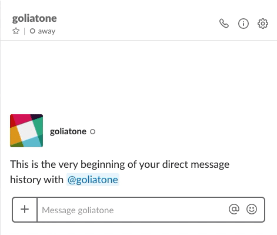

## Slack Do Not Disturb

Small CLI utility to toggle do not disturb from your terminal using the Slack API.

It has two self explanatory commands `enable` and `disable`.



```
Utility to toggle macOS do not disturb using notification center
Usage: 
    dnd-macos [subcommand] {enable|disable}
    -token: Slack API auth token
    -status-text: Slack status text
    -status-emoji: Slack status emoji
```

